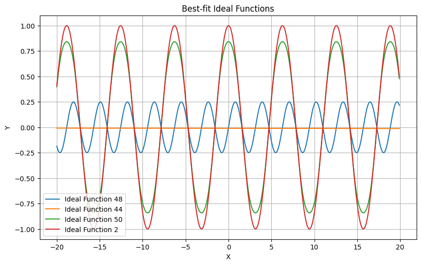
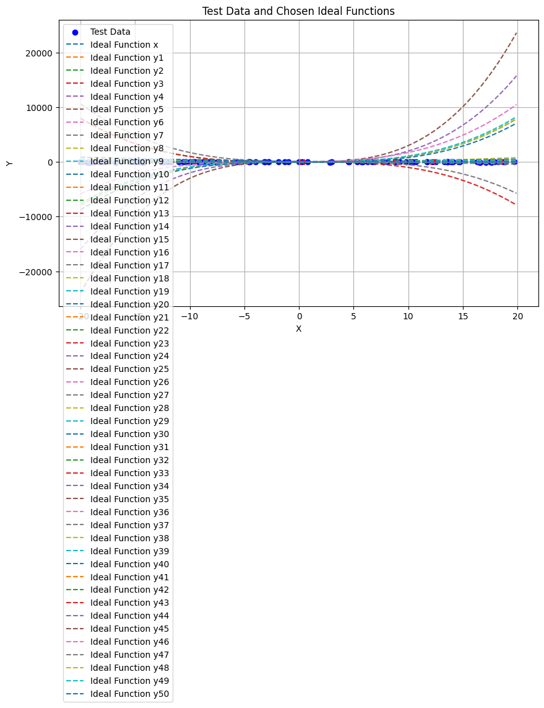

#Ideal Functions

#Deviations Plot

#GIT COMMANDS
1.Clone the 'develop' branch to your local PC:
git clone -b develop <repository_url>

2.Navigate to the cloned repository:
cd <repository_name>

3.Create and checkout a new branch for your changes:
git checkout -b feature/new-function

4.Make changes and add the new function to your project.

5.Stage the changes for commit:
git add .

6.Commit the changes:
git commit -m "Add new function"

7.Push the changes to your fork on the remote repository:
git push origin feature/new-function

8.Go to the repository's page on the Git hosting service (e.g., GitHub, GitLab) and create a pull request from your 'feature/new-function' branch to the 'develop' branch.

9.Wait for the team members to review your changes and approve the pull request.

10.Once approved, merge your changes into the 'develop' branch:
git checkout develop
git pull origin develop
git merge feature/new-function
